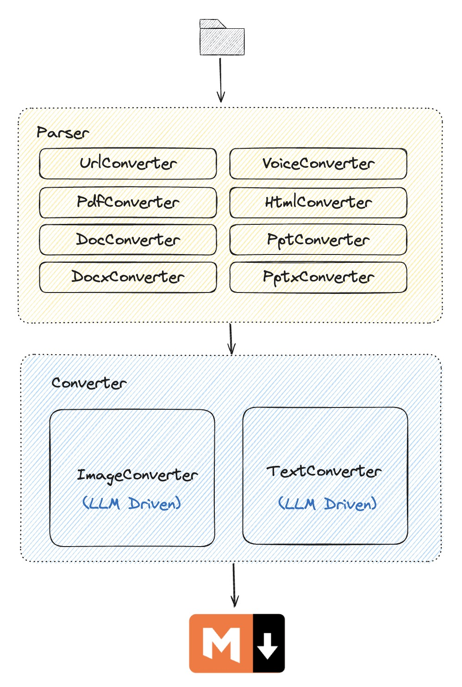

<p align="center">
  
</p>

<p align="center">
    <a href="https://github.com/user/repo/blob/main/LICENSE">
        
    </a>
    <a href="https://github.com/wisupai/e2m">
        
    </a>
    <a href="https://github.com/Jing-yilin/E2M/tags/0.1.54">
        
    </a>
    <a href="https://www.python.org/downloads/">
        
    </a>
    <a href="https://github.com/wisupai/e2m/blob/main/README-zh.md">
        
    </a>
</p>

# 🚀 E2M: Everything to Markdown

**Everything to Markdown**

E2M是一个能够把多种文件类型解析并转换成Markdown格式的Python库，通过解析器+转换器的架构，实现对doc, docx, epub, html, htm, url, pdf, ppt, pptx, mp3, m4a等多种文件格式的转换。

✨E2M项目的终极目标是为了RAG和模型训练、微调，提供高质量的数据。

项目的核心架构：

- 解析器：负责将各种文件类型解析为文本或图片数据
- 转换器：负责将文本或图片数据转换为Markdown格式

一般来说，对于任意类型的文件，需要先运行解析器，获取文件内部的text、image等数据，然后再运行转换器，将数据转换为Markdown格式。

<iframe src="//player.bilibili.com/player.html?isOutside=true&aid=113018574734429&bvid=BV1HvWeenEYQ&cid=500001661179035&p=1" scrolling="no" border="0" frameborder="no" framespacing="0" allowfullscreen="true" height="400""> </iframe>

<p align="center">
  
</p>

## 📂 所有的Parser和Converter

<table>
  <thead>
    <tr>
      <th colspan="3" style="text-align:center;">Parser</th>
    </tr>
    <tr>
      <th>Parser Type</th>
      <th>Engine</th>
      <th>Supported File Type</th>
    </tr>
  </thead>
  <tbody>
    <tr>
      <td>PdfParser</td>
      <td>surya_layout, marker, unstructured</td>
      <td>pdf</td>
    </tr>
    <tr>
      <td>DocParser</td>
      <td>xml</td>
      <td>doc</td>
    </tr>
    <tr>
      <td>DocxParser</td>
      <td>xml</td>
      <td>docx</td>
    </tr>
    <tr>
      <td>PptParser</td>
      <td>unstructured</td>
      <td>ppt</td>
    </tr>
    <tr>
      <td>PptxParser</td>
      <td>unstructured</td>
      <td>pptx</td>
    </tr>
    <tr>
      <td>UrlParser</td>
      <td>unstructured, jina, firecrawl</td>
      <td>url</td>
    </tr>
    <tr>
      <td>EpubParser</td>
      <td>unstructured</td>
      <td>epub</td>
    </tr>
    <tr>
      <td>HtmlParser</td>
      <td>unstructured</td>
      <td>html, htm</td>
    </tr>
    <tr>
      <td>VoiceParser</td>
      <td>openai_whisper_api, openai_whisper_local, SpeechRecognition</td>
      <td>mp3, m4a</td>
    </tr>
  </tbody>
</table>


<table>
  <thead>
    <tr>
      <th colspan="3" style="text-align:center;">Converter</th>
    </tr>
    <tr>
      <th>Converter Type</th>
      <th>Engine</th>
      <th>Strategy</th>
    </tr>
  </thead>
  <tbody>
    <tr>
      <td>ImageConverter</td>
      <td>litellm, zhipuai (图像识别表现不佳,不推荐)</td>
      <td>default</td>
    </tr>
    <tr>
      <td>TextConverter</td>
      <td>litellm, zhipuai</td>
      <td>default</td>
    </tr>
  </tbody>
</table>

## 📦 安装

创建环境:
```bash
conda create -n e2m python=3.10
conda activate e2m
```

使用 pip 安装 E2M：

```bash
# 选项 1: 通过pip安装
pip install wisup_e2m
# 选项 2: 通过git安装
pip install git+https://github.com/wisupai/e2m.git
# 选项 3: 手动安装
git clone https://github.com/wisupai/e2m.git
pip install poetry
poetry build
pip install dist/wisup_e2m-0.1.41-py3-none-any.whl
```

## ⚡️ 解析器: 快速开始

以下是使用 E2M 解析器的简单示例：

### 📄 PDF 解析器

```python
from wisup_e2m import PdfParser

pdf_path = "./test.pdf"
parser = PdfParser(engine="marker") # pdf 引擎: marker, unstructured, surya_layout
pdf_data = parser.parse(pdf_path)
print(pdf_data.text)
```

### 📝 DOC 解析器

```python
from wisup_e2m import DocParser

doc_path = "./test.doc"
parser = DocParser(engine="xml") # doc 引擎: unstructured
doc_data = parser.parse(doc_path)
print(doc_data.text)
```

### 📜 DOCX 解析器

```python
from wisup_e2m import DocxParser

docx_path = "./test.docx"
parser = DocxParser(engine="xml") # docx 引擎: unstructured
docx_data = parser.parse(docx_path)
print(docx_data.text)
```

### 📚 EPUB 解析器

```python
from wisup_e2m import EpubParser

epub_path = "./test.epub"
parser = EpubParser(engine="unstructured") # epub 引擎: unstructured
epub_data = parser.parse(epub_path)
print(epub_data.text)
```

### 🌐 HTML 解析器

```python
from wisup_e2m import HtmlParser

html_path = "./test.html"
parser = HtmlParser(engine="unstructured") # html 引擎: unstructured
html_data = parser.parse(html_path)
print(html_data.text)
```

### 🔗 URL 解析器

```python
from wisup_e2m import UrlParser

url = "https://www.example.com"
parser = UrlParser(engine="jina") # url 引擎: jina
url_data = parser.parse(url)
print(url_data.text)
```

### 🖼️ PPT 解析器

```python
from wisup_e2m import PptParser

ppt_path = "./test.ppt"
parser = PptParser(engine="unstructured") # ppt 引擎: unstructured
ppt_data = parser.parse(ppt_path)
print(ppt_data.text)
```

### 🖼️ PPTX 解析器

```python
from wisup_e2m import PptxParser

pptx_path = "./test.pptx"
parser = PptxParser(engine="unstructured") # pptx 引擎: unstructured
pptx_data = parser.parse(pptx_path)
print(pptx_data.text)
```

### 🎤 语音解析器

```python
from wisup_e2m import VoiceParser

voice_path = "./test.mp3"
parser = VoiceParser(
  engine="openai_whisper_local", # 语音引擎: openai_whisper_api, openai_whisper_local
  model="large" # 可用模型: https://github.com/openai/whisper#available-models-and-languages
  )

voice_data = parser.parse(voice_path)
print(voice_data.text)
```

## 🔄 转换器: 快速开始

以下是使用 E2M 转换器的简单示例：

### 📝 文本转换器

```python
from wisup_e2m import TextConverter

text = "从任何解析器解析的文本数据"
converter = TextConverter(
  engine="litellm", # 文本引擎: litellm
  model="deepseek/deepseek-chat",
  api_key="你的 API 密钥",
  base_url="你的基础 URL"
  )
text_data = converter.convert(text)
print(text_data)
```

### 🖼️ 图片转换器

```python
from wisup_e2m import ImageConverter

images = ["./test1.png", "./test2.png"]
converter = ImageConverter(
  engine="litellm", # 图片引擎: litellm
  model="gpt-4o",
  api_key="你的 API 密钥",
  base_url="你的基础 URL"
  )
image_data = converter.convert(images)
print(image_data)
```

## 🆙 下一步

### 🛠️ E2MParser

`E2MParser` 是一个集成解析器，支持多种文件类型。可以将各种文件类型解析为 Markdown 格式。

```python
from wisup_e2m import E2MParser

# 使用配置文件初始化解析器
ep = E2MParser.from_config("config.yaml")

# 解析指定文件
data = ep.parse(file_name="/path/to/file.pdf")

# 将解析的数据以字典格式打印
print(data.to_dict())
```

### 🛠️ E2MConverter

`E2MConverter` 是一个集成转换器，支持文本和图片转换。可以将文本和图片转换为 Markdown 格式。

```python
from wisup_e2m import E2MConverter

ec = E2MConverter.from_config("./config.yaml")

text = "从任何解析器解析的文本数据"

ec.convert(text=text)

images = ["test.jpg", "test.png"]
ec.convert(images=images)
```

你可以使用 `config.yaml` 文件来指定要使用的解析器和转换器。以下是一个 `config.yaml` 文件的示例：

```yaml
parsers:
    doc_parser:
        engine: "xml"
        langs: ["en", "zh"]
    docx_parser:
        engine: "xml"
        langs: ["en", "zh"]
    epub_parser:
        engine: "unstructured"
        langs: ["en", "zh"]
    html_parser:
        engine: "unstructured"
        langs: ["en", "zh"]
    url_parser:
        engine: "jina"
        langs: ["en", "zh"]
    pdf_parser:
        engine: "marker"
        langs: ["en", "zh"]
    pptx_parser:
        engine: "unstructured"
        langs: ["en", "zh"]
    voice_parser:
        # 选项1: 使用 openai whisper API
        # engine: "openai_whisper_api"
        # api_base: "https://api.openai.com/v1"
        # api_key: "你的 API 密钥"
        # model: "whisper"

        # 选项2: 使用本地 whisper 模型
        engine: "openai_whisper_local"
        model: "large" # 可用模型: https://github.com/openai/whisper#available-models-and-languages

converters:
    text_converter:
        engine: "litellm"
        model: "deepseek/deepseek-chat"
        api_key: "你的 API 密钥"
        # base_url: ""
    image_converter:
        engine: "litellm"
        model: "gpt-4o-mini"
        api_key: "你的 API 密钥"
        # base_url: ""
```

## ❓ 问答

- 为什么要设置解析器和转换器，为什么不能直接一步到位实现markdown转换？
  - 解析器的核心核心目的是为了获取文本、图片等数据，而不对数据进行过多的处理。在一些知识库等项目中，并不是所有的文件都有转换成Markdown的需要，可能通过解析出来的文件、图片内容，已经能满足基本RAG等检索需要，那么便不需要额外开销在格式转换上。
  - 在解析出来的图片、文本的基础上，转换器可以进一步修复和格式化数据，使其更适合用于RAG等模型的训练和微调。

- 为什么`PdfParser`解析出来的Markdown文本效果不佳，如何实现效果最佳的转换？
  - `PdfParser`的核心功能是解析而非直接转换成Markdown。
  - `PdfParser`支持三个引擎:
    - `marker`，参考了著名的`marker`项目，虽然能直接实现markdown的转换，但是因为在复杂文本上效果欠佳，所以做为解析器的一部分。
    - `unstructured`，解析出来的文本是原始文本，在格式排版上几乎没有什么效果，推荐在格式比较整齐的pdf解析上使用。
    - `surya_layout`，解析出来的并非文本而是标记了布局信息的图片，需要再配合`ImageConverter`进行转换，如果`ImageConverter`使用的是`gpt-4o`等多模态模型，转换成Markdown的效果是最好的，可匹配某些商用转换软件。
  - 以下是转换效果最好的代码示例:
    ```python
    import os
    from wisup_e2m import PdfParser, ImageConverter
    
    work_dir = os.getcwd() # 以当前的路径作为工作路径
    image_dir = os.path.join(work_dir, "figure")
    
    pdf = "./test.pdf"
    
    # 加载解析器
    pdf_parser = PdfParser(engine="surya_layout")
    # 加载转换器
    image_converter = ImageConverter(
        engine="litellm",
        api_key="<you api key>", # 修改为你的API key
        model="gpt-4o",
        base_url="<you base url>", # 如果使用了模型代理，需要填写base url
        caching=True,
        cache_type="disk-cache",
    )
    
    # 解析PDF为图片
    pdf_data = pdf_parser.parse(
        pdf,
        start_page=0, # 开始页码
        end_page=20, # 结束页码
        work_dir=work_dir,
        image_dir=image_dir, # 提取的图片保存的地方
        relative_path=True, # 图片路径是否为相对路径(相对于work_dir)
    )
    
    # 通过 ImageConverter 将图片转换为文本
    md_text = image_converter.convert(
        images = pdf_data.images,
        attached_images_map= pdf_data.attached_images_map,
        work_dir=work_dir, # 图片在Markdown中的地址会相对于 workdir，默认是绝对路径
    )
    
    # save test markdown
    with open("test.md", "w") as f:
        f.write(md_text)
    ```

- Resource xxx not found. Please use the NLTK Downloader to obtain the resource:
  ```python
  import nltk
  nltk.download('all') # 最好直接下载所有资源,3.57G
  ```

-   未找到资源 wordnet。
    -   完全卸载 `nltk`：`pip uninstall nltk`
    -   使用以下命令重新安装 `nltk`：`pip install nltk`
    -   手动下载 [corpora/wordnet.zip](https://raw.githubusercontent.com/nltk/nltk_data/gh-pages/packages/corpora/wordnet.zip) 并将其解压缩到错误消息中指定的目录。或者，您可以使用以下命令下载：
        -   Windows: `wget https://raw.githubusercontent.com/nltk/nltk_data/gh-pages/packages/corpora/wordnet.zip -O ~\AppData\Roaming\nltk_data\corpora\wordnet.zip` 并 `unzip ~\AppData\Roaming\nltk_data\corpora\wordnet.zip -d ~\AppData\Roaming\nltk_data\corpora\`
        -   Unix: `wget https://raw.githubusercontent.com/nltk/nltk_data/gh-pages/packages/corpora/wordnet.zip -O ~/nltk_data/corpora/wordnet.zip` 并 `unzip ~/nltk_data/corpora/wordnet.zip -d ~/nltk_data/corpora/`

## 📜 许可证

此项目基于 MIT 许可证。详情请参见 [LICENSE](LICENSE) 文件。

## 📧 联系我们

扫描以下二维码加入我们的微信群(备注来自e2m项目):

<p align="center">
  
</p>

如有任何问题或疑问，请在 [GitHub](https://github.com/wisupai/e2m) 上创建 issue 或通过 [team@wisup.ai](mailto:team@wisup.ai) 联系我们。

## 🌟 贡献

<a href="https://github.com/wisupai/e2m/graphs/contributors">
  
</a>