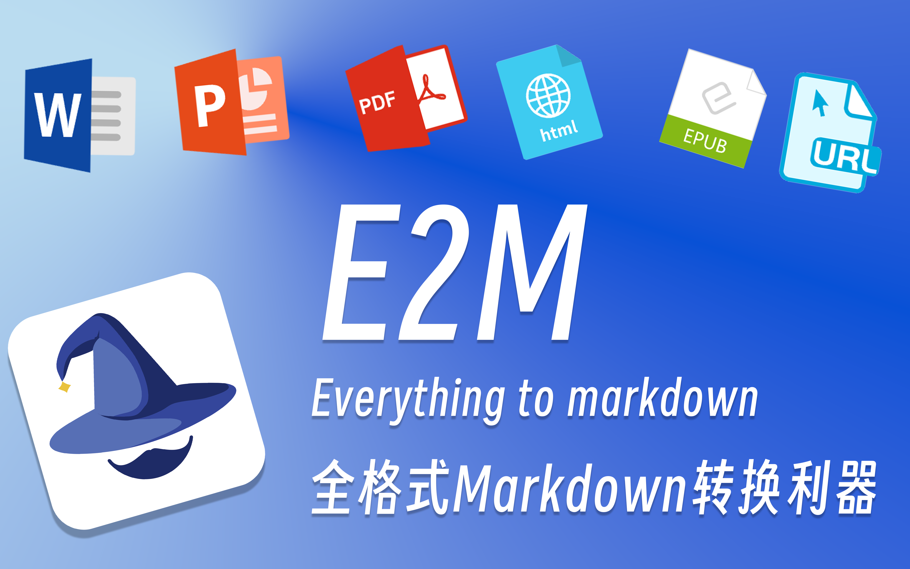

<p align="center">
  
</p>

<p align="center">
    <a href="https://github.com/user/repo/blob/main/LICENSE">
        
    </a>
    <a href="https://github.com/wisupai/e2m">
        
    </a>
    <a href="https://github.com/Jing-yilin/E2M/tags/0.1.6">
        
    </a>
    <a href="https://www.python.org/downloads/">
        
    </a>
    <a href="https://pypi.org/project/wisup_e2m/">
        
    </a>
    <a href="https://github.com/wisupai/e2m/blob/main/README-zh.md">
        
    </a>
</p>

# 🚀 E2M: Everything to Markdown

**Everything to Markdown**

E2M is a Python library that can parse and convert various file types into Markdown format. By utilizing a parser-converter architecture, it supports the conversion of multiple file formats, including doc, docx, epub, html, htm, url, pdf, ppt, pptx, mp3, and m4a.

✨The ultimate goal of the E2M project is to provide high-quality data for Retrieval-Augmented Generation (RAG) and model training or fine-tuning.

**Core Architecture of the Project:**

- **Parser**: Responsible for parsing various file types into text or image data.
- **Converter**: Responsible for converting text or image data into Markdown format.

Generally, for any type of file, the parser is run first to extract internal data such as text and images. Then, the converter is used to transform this data into Markdown format.


<p align="center">
  
</p>

## 📹 Video Introduction

<div align="center">
  <a href="https://www.bilibili.com/video/BV1HvWeenEYQ">
    
  </a>
</div>

## 📂 All Converters and Parsers

<table>
  <thead>
    <tr>
      <th colspan="3" style="text-align:center;">Parser</th>
    </tr>
    <tr>
      <th>Parser Type</th>
      <th>Engine</th>
      <th>Supported File Type</th>
    </tr>
  </thead>
  <tbody>
    <tr>
      <td>PdfParser</td>
      <td>surya_layout, marker, unstructured</td>
      <td>pdf</td>
    </tr>
    <tr>
      <td>DocParser</td>
      <td>xml</td>
      <td>pandoc, xml</td>
    </tr>
    <tr>
      <td>DocxParser</td>
      <td>xml</td>
      <td>pandoc, xml</td>
    </tr>
    <tr>
      <td>PptParser</td>
      <td>unstructured</td>
      <td>ppt</td>
    </tr>
    <tr>
      <td>PptxParser</td>
      <td>unstructured</td>
      <td>pptx</td>
    </tr>
    <tr>
      <td>UrlParser</td>
      <td>unstructured, jina, firecrawl</td>
      <td>url</td>
    </tr>
    <tr>
      <td>EpubParser</td>
      <td>unstructured</td>
      <td>epub</td>
    </tr>
    <tr>
      <td>HtmlParser</td>
      <td>unstructured</td>
      <td>html, htm</td>
    </tr>
    <tr>
      <td>VoiceParser</td>
      <td>openai_whisper_api, openai_whisper_local, SpeechRecognition</td>
      <td>mp3, m4a</td>
    </tr>
  </tbody>
</table>


<table>
  <thead>
    <tr>
      <th colspan="3" style="text-align:center;">Converter</th>
    </tr>
    <tr>
      <th>Converter Type</th>
      <th>Engine</th>
      <th>Strategy</th>
    </tr>
  </thead>
  <tbody>
    <tr>
      <td>ImageConverter</td>
      <td>litellm, zhipuai (Not Well in Image Recognition, Not Recommended)</td>
      <td>default</td>
    </tr>
    <tr>
      <td>TextConverter</td>
      <td>litellm, zhipuai</td>
      <td>default</td>
    </tr>
  </tbody>
</table>

## 📦 Installation

Create Environment:
```bash
conda create -n e2m python=3.10
conda activate e2m
```

Update pip:
```bash
pip install --upgrade pip
```

Install E2M using pip:

```bash
# Option 1: Install via pip
pip install wisup_e2m
# Option 2: Install via git
pip install git+https://github.com/wisupai/e2m.git --index-url https://pypi.org/simple
# Option 3: Manual installation
git clone https://github.com/wisupai/e2m.git
cd e2m
pip install poetry
poetry build
pip install dist/wisup_e2m-0.1.6-py3-none-any.whl
```

## ⚡️ Parser Quick Start

Here's simple examples demonstrating how to use E2M Parsers:

### 📄 Pdf Parser

```python
from wisup_e2m import PdfParser

pdf_path = "./test.pdf"
parser = PdfParser(engine="marker") # pdf engines: marker, unstructured, surya_layout
pdf_data = parser.parse(pdf_path)
print(pdf_data.text)
```

### 📝 Doc Parser

```python
from wisup_e2m import DocParser

doc_path = "./test.doc"
parser = DocParser(engine="pandoc") # doc engines: pandoc, xml
doc_data = parser.parse(doc_path)
print(doc_data.text)
```

### 📜 Docx Parser

```python
from wisup_e2m import DocxParser

docx_path = "./test.docx"
parser = DocxParser(engine="pandoc") # docx engines: pandoc, xml
docx_data = parser.parse(docx_path)
print(docx_data.text)
```

### 📚 Epub Parser

```python
from wisup_e2m import EpubParser

epub_path = "./test.epub"
parser = EpubParser(engine="unstructured") # epub engines: unstructured
epub_data = parser.parse(epub_path)
print(epub_data.text)
```

### 🌐 Html Parser

```python
from wisup_e2m import HtmlParser

html_path = "./test.html"
parser = HtmlParser(engine="unstructured") # html engines: unstructured
html_data = parser.parse(html_path)
print(html_data.text)
```

### 🔗 Url Parser

```python
from wisup_e2m import UrlParser

url = "https://www.example.com"
parser = UrlParser(engine="jina") # url engines: jina, firecrawl, unstructured
url_data = parser.parse(url)
print(url_data.text)
```

### 🖼️ Ppt Parser

```python
from wisup_e2m import PptParser

ppt_path = "./test.ppt"
parser = PptParser(engine="unstructured") # ppt engines: unstructured
ppt_data = parser.parse(ppt_path)
print(ppt_data.text)
```

### 🖼️ Pptx Parser

```python
from wisup_e2m import PptxParser

pptx_path = "./test.pptx"
parser = PptxParser(engine="unstructured") # pptx engines: unstructured
pptx_data = parser.parse(pptx_path)
print(pptx_data.text)
```

### 🎤 Voice Parser

```python
from wisup_e2m import VoiceParser

voice_path = "./test.mp3"
parser = VoiceParser(
  engine="openai_whisper_local", # voice engines: openai_whisper_api, openai_whisper_local
  model="large" # available models: https://github.com/openai/whisper#available-models-and-languages
  )

voice_data = parser.parse(voice_path)
print(voice_data.text)
```

## 🔄 Converter Quick Start

Here's simple examples demonstrating how to use E2M Converters:

### 📝 Text Converter

```python
from wisup_e2m import TextConverter

text = "Parsed text data from any parser"
converter = TextConverter(
  engine="litellm", # text engines: litellm
  model="deepseek/deepseek-chat",
  api_key="your api key",
  base_url="your base url"
  )
text_data = converter.convert(text)
print(text_data)
```

### 🖼️ Image Converter

```python
from wisup_e2m import ImageConverter

images = ["./test1.png", "./test2.png"]
converter = ImageConverter(
  engine="litellm", # image engines: litellm
  model="gpt-4o",
  api_key="your api key",
  base_url="your base url"
  )
image_data = converter.convert(image_path)
print(image_data)
```

## 🆙 Next Level

### 🛠️ E2MParser

`E2MParser` is an integrated parser that supports multiple file types. It can be used to parse a wide range of file types into Markdown format.

```python
from wisup_e2m import E2MParser

# Initialize the parser with your configuration file
ep = E2MParser.from_config("config.yaml")

# Parse the desired file
data = ep.parse(file_name="/path/to/file.pdf")

# Print the parsed data as a dictionary
print(data.to_dict())
```

### 🛠️ E2MConverter

`E2MConverter` is an integrated converter that supports text and image conversion. It can be used to convert text and images into Markdown format.

```python
from wisup_e2m import E2MConverter

ec = E2MConverter.from_config("./config.yaml")

text = "Parsed text data from any parser"

ec.convert(text=text)

images = ["test.jpg", "test.png"]
ec.convert(images=images)
```

You can use a `config.yaml` file to specify the parsers and converters you want to use. Here is an example of a `config.yaml` file:


```yaml
parsers:
    doc_parser:
        engine: "pandoc"
        langs: ["en", "zh"]
    docx_parser:
        engine: "pandoc"
        langs: ["en", "zh"]
    epub_parser:
        engine: "unstructured"
        langs: ["en", "zh"]
    html_parser:
        engine: "unstructured"
        langs: ["en", "zh"]
    url_parser:
        engine: "jina"
        langs: ["en", "zh"]
    pdf_parser:
        engine: "marker"
        langs: ["en", "zh"]
    pptx_parser:
        engine: "unstructured"
        langs: ["en", "zh"]
    voice_parser:
        # option 1: use openai whisper api
        # engine: "openai_whisper_api"
        # api_base: "https://api.openai.com/v1"
        # api_key: "your_api_key"
        # model: "whisper"

        # option 2: use local whisper model
        engine: "openai_whisper_local"
        model: "large" # available models: https://github.com/openai/whisper#available-models-and-languages

converters:
    text_converter:
        engine: "litellm"
        model: "deepseek/deepseek-chat"
        api_key: "your_api_key"
        # base_url: ""
    image_converter:
        engine: "litellm"
        model: "gpt-4o-mini"
        api_key: "your_api_key"
        # base_url: ""
```

## ❓ Q&A

[FAQ Document](./docs/faq/FAQ-en.md)

## 📜 License

This project is licensed under the MIT License. See the [LICENSE](LICENSE) file for details.

## 📧 Contact

You can scan the QR code below to join our WeChat group:

<p align="center">
  
</p>

For any questions or inquiries, please open an issue on [GitHub](https://github.com/wisupai/e2m) or contact us at [team@wisup.ai](mailto:team@wisup.ai).

Contact for business cooperation: [team@wisup.ai](mailto:team@wisup.ai)

## 💼 Join Us

<p align="center">
  
</p>

- Wisup is an AI startup with a strong focus on data and algorithms. We specialize in providing high-quality data and algorithm services for enterprises. We embrace a remote working model and welcome talented individuals from around the world to join us.

- Our philosophy: From information to data, from data to knowledge, from knowledge to value.

- Our vision: To make the world a better place through data.

- We are looking for: Like-minded Co-Founders
  - No restrictions on education, age, location, race, or gender
  - Keen interest in AI and familiarity with AI and related vertical industries
  - Passionate about AI and data, with a strong sense of purpose
  - Possess unique strengths, responsibility, and a team-oriented mindset

- To apply, send your resume to: [team@wisup.ai](mailto:team@wisup.ai)

- You also need to answer three questions in your email:
  - What makes you irreplaceable?
  - What is the most challenging situation you have faced, and how did you resolve it?
  - How do you view the future development of AI?

## 🌟 Contributing

<a href="https://github.com/wisupai/e2m/graphs/contributors">
  
</a>
