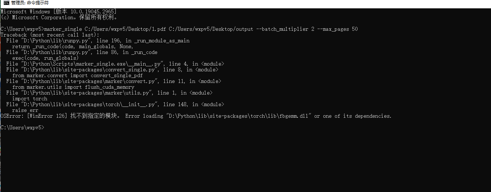

# FAQ

- [FAQ](#faq)
  - [Why set up parsers and converters instead of converting to Markdown directly?](#why-set-up-parsers-and-converters-instead-of-converting-to-markdown-directly)
  - [Why does the `PdfParser` produce poor Markdown text, and how to achieve optimal conversion?](#why-does-the-pdfparser-produce-poor-markdown-text-and-how-to-achieve-optimal-conversion)
  - [Unable to connect to 'https://huggingface.co'](#unable-to-connect-to-httpshuggingfaceco)
  - [Resource xxx not found. Please use the NLTK Downloader to obtain the resource:](#resource-xxx-not-found-please-use-the-nltk-downloader-to-obtain-the-resource)
  - [Resource 'wordnet' not found.](#resource-wordnet-not-found)
  - [Steps to resolve PyTorch `fbgemm.dll` loading error](#steps-to-resolve-pytorch-fbgemmdll-loading-error)

## Why set up parsers and converters instead of converting to Markdown directly?

-   The core purpose of a parser is to extract data such as text and images without too much processing. In some projects like knowledge bases, not all files need to be converted to Markdown. The extracted file or image content might already suffice for basic RAG (Retrieval-Augmented Generation) needs, eliminating the need for additional formatting overhead.
-   Based on the extracted images and text, a converter can further refine and format the data, making it more suitable for training and fine-tuning models like RAG.

## Why does the `PdfParser` produce poor Markdown text, and how to achieve optimal conversion?

-   The core function of `PdfParser` is parsing, not directly converting to Markdown.
-   `PdfParser` supports three engines:
    -   `marker`, inspired by the well-known `marker` project. It can directly convert to Markdown but performs poorly with complex texts, thus serving as part of the parser.
    -   `unstructured`, which outputs raw text with minimal formatting, recommended for PDFs with a clean layout.
    -   `surya_layout`, which outputs images marked with layout information. These need to be converted using `ImageConverter`. If `ImageConverter` uses multimodal models like `gpt-4o`, the Markdown conversion quality is optimal, matching some commercial conversion software.
-   Below is an example of the best conversion code:

    ```python
    import os
    from wisup_e2m import PdfParser, ImageConverter

    work_dir = os.getcwd()  # Set the current path as the working directory
    image_dir = os.path.join(work_dir, "figure")

    pdf = "./test.pdf"

    # Load the parser
    pdf_parser = PdfParser(engine="surya_layout")
    # Load the converter
    image_converter = ImageConverter(
        engine="litellm",
        api_key="<your API key>",  # Replace with your API key
        model="gpt-4o",
        base_url="<your base url>",  # Fill in the base URL if using a model proxy
        caching=True,
        cache_type="disk-cache",
    )

    # Parse the PDF into images
    pdf_data = pdf_parser.parse(
        pdf,
        start_page=0,  # Starting page number
        end_page=20,  # Ending page number
        work_dir=work_dir,
        image_dir=image_dir,  # Location to save extracted images
        relative_path=True,  # Whether the image path is relative to work_dir
    )

    # Convert images to text using ImageConverter
    md_text = image_converter.convert(
        images=pdf_data.images,
        attached_images_map=pdf_data.attached_images_map,
        work_dir=work_dir,  # Image addresses in Markdown will be relative to workdir; absolute path by default
    )

    # Save the test markdown
    with open("test.md", "w") as f:
        f.write(md_text)
    ```

## Unable to connect to 'https://huggingface.co'

-   **Method 1:** Try accessing via a VPN or proxy.
-   **Method 2:** Use a mirror in the code:
    ```python
    import os
    os.environ['CURL_CA_BUNDLE'] = ''
    os.environ['HF_ENDPOINT']= 'https://hf-mirror.com'
    ```
-   **Method 3:** Set environment variables in the terminal:
    ```bash
    export CURL_CA_BUNDLE=''
    export HF_ENDPOINT='https://hf-mirror.com'
    ```

## Resource xxx not found. Please use the NLTK Downloader to obtain the resource:

```python
import nltk
nltk.download('all')  # Best to download all resources, around 3.57GB
```

## Resource 'wordnet' not found.

-   Completely uninstall `nltk`: `pip uninstall nltk`
-   Reinstall `nltk` with the command: `pip install nltk`
-   Manually download [corpora/wordnet.zip](https://raw.githubusercontent.com/nltk/nltk_data/gh-pages/packages/corpora/wordnet.zip) and extract it to the directory specified in the error message. Alternatively, use the following commands to download:
    -   **Windows:** `wget https://raw.githubusercontent.com/nltk/nltk_data/gh-pages/packages/corpora/wordnet.zip -O ~\AppData\Roaming\nltk_data\corpora\wordnet.zip` and `unzip ~\AppData\Roaming\nltk_data\corpora\wordnet.zip -d ~\AppData\Roaming\nltk_data\corpora\`
    -   **Unix:** `wget https://raw.githubusercontent.com/nltk/nltk_data/gh-pages/packages/corpora/wordnet.zip -O ~/nltk_data/corpora/wordnet.zip` and `unzip ~/nltk_data/corpora/wordnet.zip -d ~/nltk_data/corpora/`

## Steps to resolve PyTorch `fbgemm.dll` loading error

When running PyTorch code, you might encounter a `fbgemm.dll` loading error (`OSError: [WinError 126] The specified module could not be found`). Even if the `fbgemm.dll` file is in the correct path, the problem may still persist. Here are detailed troubleshooting and resolution steps.



1. **Install PyTorch and use a Conda virtual environment**

    Sometimes, directly installing via `pip` may cause dependency issues. Creating a new environment using `conda` and installing PyTorch might help resolve this. Here is an example:

    ```bash
    conda create -n pytorch_env python=3.10
    conda activate pytorch_env
    conda install pytorch torchvision torchaudio cudatoolkit=11.3 -c pytorch
    ```

    This ensures PyTorch and all its dependencies are correctly installed, and path configuration won't be an issue.

2. **Install or update the VS Redistributable**

    PyTorch depends on the Microsoft Visual C++ Redistributable runtime libraries. If these libraries are missing or the version is incorrect, it may lead to DLL loading failure.

    - Download and install the latest version of the Microsoft Visual C++ Redistributable (including both x64 and x86 versions) from the [Microsoft website](https://docs.microsoft.com/en-us/cpp/windows/latest-supported-vc-redist?view=msvc-160).

3. **Check system path and dependencies**

    Even if the DLL file is present, the system may fail to load it due to missing dependencies or path issues. Here are some steps to check:

    1. **Use `Dependency Walker` or `Dependencies`**

        - Download and run the [Dependency Walker](http://www.dependencywalker.com/) tool, or use the latest [Dependencies](https://github.com/lucasg/Dependencies) tool.
        - Load the `fbgemm.dll` file to check if all its dependencies are present.

    2. **Add the path to the system environment variables**

        - Add the path containing `fbgemm.dll` (e.g., `D:\Python\lib\site-packages\torch\lib\`) to the system's `PATH` environment variable to ensure all related DLL files can be found.

4. **Use SFC and DISM to repair system files**

    If system files or DLL links are corrupted, you can use Windows' System File Checker (SFC) and Deployment Imaging Service and Management Tool (DISM) to repair them:

    - Open Command Prompt as an administrator.
    - Run the following command to repair system files:
        ```bash
        sfc /scannow
        ```
    - Use DISM to repair the Windows image:
        ```bash
        DISM /Online /Cleanup-Image /RestoreHealth
        ```
    - Restart your computer and try running your program again.

5. **Install missing DLL files**

    After checking with the `Dependencies` tool, it was found that the `libomp140.x86_64.dll` file was missing. Follow these steps to resolve:

    1. **Download the missing `libomp140.x86_64.dll`**

        - Visit a [DLL file download site](https://www.dllme.com/dll/files/libomp140_x86_64/00637fe34a6043031c9ae4c6cf0a891d/download), search for, and download the `libomp140.x86_64.dll` file.

    2. **Copy the DLL file to the `system32` directory**

        - Copy the downloaded `libomp140.x86_64.dll` file to the `C:\Windows\System32\` directory.

6. **Final Resolution**

    After completing the above steps, restart your computer or rerun your Python code, and the issue should be resolved. If the problem persists, further inspection of other dependencies or alternative solutions may be necessary.
