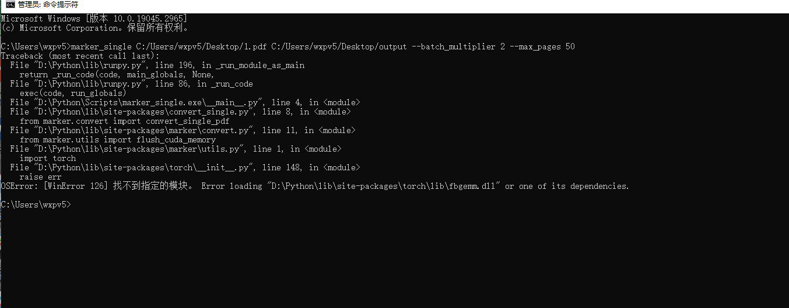

# FAQ

- [FAQ](#faq)
  - [为什么要设置解析器和转换器，为什么不能直接一步到位实现 markdown 转换？](#为什么要设置解析器和转换器为什么不能直接一步到位实现-markdown-转换)
  - [为什么`PdfParser`解析出来的 Markdown 文本效果不佳，如何实现效果最佳的转换？](#为什么pdfparser解析出来的-markdown-文本效果不佳如何实现效果最佳的转换)
  - [无法连接 'https://huggingface.co'](#无法连接-httpshuggingfaceco)
  - [Resource xxx not found. Please use the NLTK Downloader to obtain the resource:](#resource-xxx-not-found-please-use-the-nltk-downloader-to-obtain-the-resource)
  - [未找到资源 wordnet。](#未找到资源-wordnet)
  - [PyTorch `fbgemm.dll` 加载错误解决步骤](#pytorch-fbgemmdll-加载错误解决步骤)

## 为什么要设置解析器和转换器，为什么不能直接一步到位实现 markdown 转换？

-   解析器的核心核心目的是为了获取文本、图片等数据，而不对数据进行过多的处理。在一些知识库等项目中，并不是所有的文件都有转换成 Markdown 的需要，可能通过解析出来的文件、图片内容，已经能满足基本 RAG 等检索需要，那么便不需要额外开销在格式转换上。
-   在解析出来的图片、文本的基础上，转换器可以进一步修复和格式化数据，使其更适合用于 RAG 等模型的训练和微调。

## 为什么`PdfParser`解析出来的 Markdown 文本效果不佳，如何实现效果最佳的转换？

-   `PdfParser`的核心功能是解析而非直接转换成 Markdown。
-   `PdfParser`支持三个引擎:
    -   `marker`，参考了著名的`marker`项目，虽然能直接实现 markdown 的转换，但是因为在复杂文本上效果欠佳，所以做为解析器的一部分。
    -   `unstructured`，解析出来的文本是原始文本，在格式排版上几乎没有什么效果，推荐在格式比较整齐的 pdf 解析上使用。
    -   `surya_layout`，解析出来的并非文本而是标记了布局信息的图片，需要再配合`ImageConverter`进行转换，如果`ImageConverter`使用的是`gpt-4o`等多模态模型，转换成 Markdown 的效果是最好的，可匹配某些商用转换软件。
-   以下是转换效果最好的代码示例:

    ```python
    import os
    from wisup_e2m import PdfParser, ImageConverter

    work_dir = os.getcwd() # 以当前的路径作为工作路径
    image_dir = os.path.join(work_dir, "figure")

    pdf = "./test.pdf"

    # 加载解析器
    pdf_parser = PdfParser(engine="surya_layout")
    # 加载转换器
    image_converter = ImageConverter(
        engine="litellm",
        api_key="<you api key>", # 修改为你的API key
        model="gpt-4o",
        base_url="<you base url>", # 如果使用了模型代理，需要填写base url
        caching=True,
        cache_type="disk-cache",
    )

    # 解析PDF为图片
    pdf_data = pdf_parser.parse(
        pdf,
        start_page=0, # 开始页码
        end_page=20, # 结束页码
        work_dir=work_dir,
        image_dir=image_dir, # 提取的图片保存的地方
        relative_path=True, # 图片路径是否为相对路径(相对于work_dir)
    )

    # 通过 ImageConverter 将图片转换为文本
    md_text = image_converter.convert(
        images = pdf_data.images,
        attached_images_map= pdf_data.attached_images_map,
        work_dir=work_dir, # 图片在Markdown中的地址会相对于 workdir，默认是绝对路径
    )

    # save test markdown
    with open("test.md", "w") as f:
        f.write(md_text)
    ```

## 无法连接 'https://huggingface.co'

-   方法 1: 尝试通过科学上网代理访问
-   方法 2: 在代码中使用镜像
    ```python
    import os
    os.environ['CURL_CA_BUNDLE'] = ''
    os.environ['HF_ENDPOINT']= 'https://hf-mirror.com'
    ```
-   方法 3: 终端设置环境变量
    ```bash
    export CURL_CA_BUNDLE=''
    export HF_ENDPOINT='https://hf-mirror.com'
    ```

## Resource xxx not found. Please use the NLTK Downloader to obtain the resource:

```python
import nltk
nltk.download('all') # 最好直接下载所有资源,3.57G
```

## 未找到资源 wordnet。

-   完全卸载 `nltk`：`pip uninstall nltk`
-   使用以下命令重新安装 `nltk`：`pip install nltk`
-   手动下载 [corpora/wordnet.zip](https://raw.githubusercontent.com/nltk/nltk_data/gh-pages/packages/corpora/wordnet.zip) 并将其解压缩到错误消息中指定的目录。或者，您可以使用以下命令下载：
    -   Windows: `wget https://raw.githubusercontent.com/nltk/nltk_data/gh-pages/packages/corpora/wordnet.zip -O ~\AppData\Roaming\nltk_data\corpora\wordnet.zip` 并 `unzip ~\AppData\Roaming\nltk_data\corpora\wordnet.zip -d ~\AppData\Roaming\nltk_data\corpora\`
    -   Unix: `wget https://raw.githubusercontent.com/nltk/nltk_data/gh-pages/packages/corpora/wordnet.zip -O ~/nltk_data/corpora/wordnet.zip` 并 `unzip ~/nltk_data/corpora/wordnet.zip -d ~/nltk_data/corpora/`

## PyTorch `fbgemm.dll` 加载错误解决步骤

在运行 PyTorch 代码时，遇到了 `fbgemm.dll` 加载错误 (`OSError: [WinError 126] 找不到指定的模块`)，即使 `fbgemm.dll` 文件存在于正确的路径中，问题依然存在。以下是详细的排查和解决步骤。



1. 安装 PyTorch 并使用 Conda 虚拟环境

    有时候直接使用 `pip` 安装可能会有一些依赖问题，使用 `conda` 创建新的环境并安装 PyTorch 可能会帮助解决这个问题。以下是一个例子：

    ```bash
    conda create -n pytorch_env python=3.8
    conda activate pytorch_env
    conda install pytorch torchvision torchaudio cudatoolkit=11.3 -c pytorch
    ```

    这样可以确保 PyTorch 及其所有依赖项都正确安装，并且路径配置不会出问题。

2. 安装或更新 VS Redistributable

    PyTorch 依赖于 Microsoft Visual C++ Redistributable 运行时库。如果这些库缺失或版本不对，可能会导致 DLL 加载失败。

    - 从[微软官网](https://docs.microsoft.com/zh-cn/cpp/windows/latest-supported-vc-redist?view=msvc-160)下载并安装最新版本的 Microsoft Visual C++ Redistributable（包括 x64 和 x86 版本）。

3. 检查系统路径和依赖项

    即使 DLL 文件存在，系统仍可能由于依赖项缺失或路径问题而无法加载它。以下是一些检查步骤：

    1. 使用 `Dependency Walker` 或 `Dependencies`

        - 下载并运行 [Dependency Walker](http://www.dependencywalker.com/) 工具，或使用最新的 [Dependencies](https://github.com/lucasg/Dependencies) 工具。
        - 加载 `fbgemm.dll` 文件来检查它的依赖项是否都存在。

    2. 添加路径到系统环境变量

        - 将包含 `fbgemm.dll` 的路径（例如 `D:\Python\lib\site-packages\torch\lib\`）添加到系统的环境变量 `PATH` 中，以确保系统可以找到所有相关的 DLL 文件。

4. 使用 SFC 和 DISM 修复系统文件

    如果系统文件或 DLL 链接被破坏，可以使用 Windows 的系统文件检查器 (SFC) 和部署映像服务和管理工具 (DISM) 来修复它们：

    - 打开命令提示符（以管理员身份运行）。
    - 运行以下命令修复系统文件：
        ```bash
        sfc /scannow
        ```
    - 使用 DISM 来修复 Windows 映像：
        ```bash
        DISM /Online /Cleanup-Image /RestoreHealth
        ```
    - 重启计算机后，再尝试运行你的程序。

5. 安装缺失的 DLL 文件

    在使用 `Dependencies` 工具检查后，发现缺少 `libomp140.x86_64.dll` 文件。按以下步骤解决：

    1. 下载缺失的 `libomp140.x86_64.dll`

        - 访问 [DLL 文件下载网站](https://www.dllme.com/dll/files/libomp140_x86_64/00637fe34a6043031c9ae4c6cf0a891d/download)，搜索并下载 `libomp140.x86_64.dll` 文件。

    2. 复制 DLL 文件到 `system32` 目录

        - 将下载的 `libomp140.x86_64.dll` 文件复制到 `C:\Windows\System32\` 目录下。

6. 最终解决

    上述步骤完成后，重启计算机或重新运行你的 Python 代码，问题应该得以解决。如果问题仍然存在，可能需要进一步检查其他依赖项或考虑不同的解决方案。
