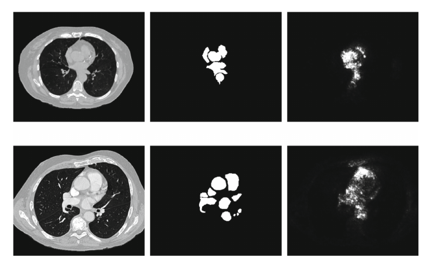
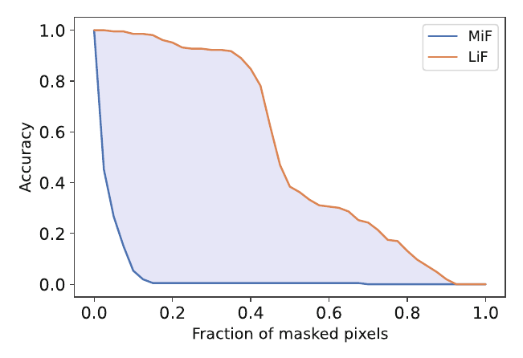
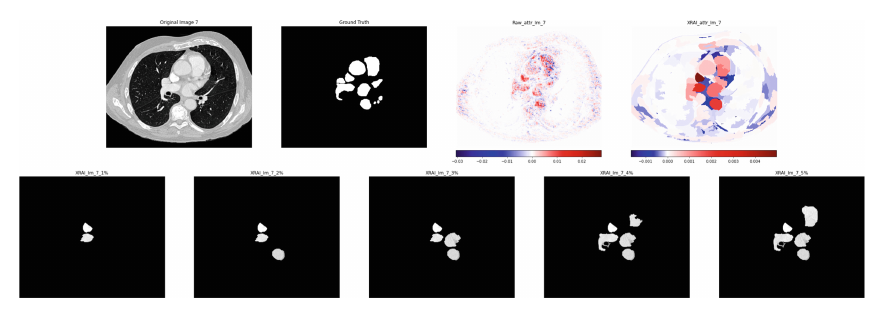
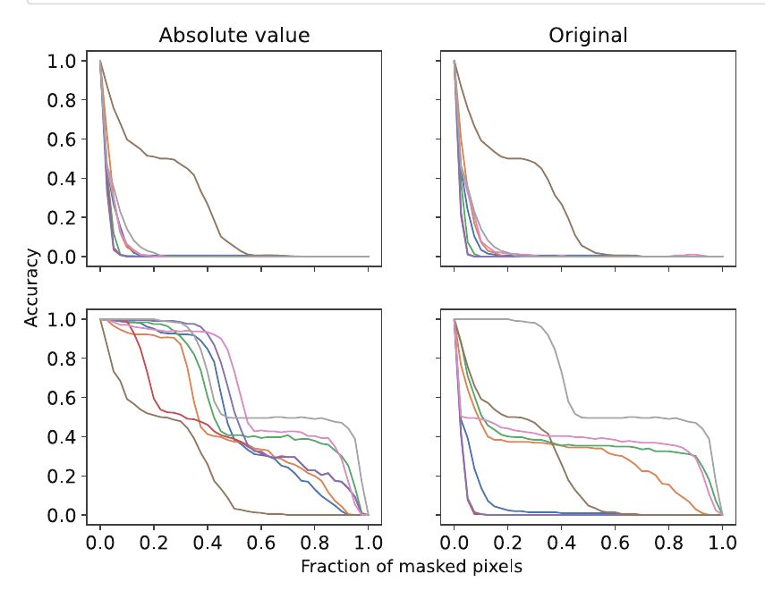

# Explainable and Transparent AI and Multi-Agent Systems

4th International Workshop, EXTRAAMAS 2022  
Virtual Event, May 9–10, 2022  
Revised Selected Papers

---

**Lecture Notes in Artificial Intelligence** 13283

Subseries of Lecture Notes in Computer Science

Series Editors  
Randy Goebel  
*University of Alberta, Edmonton, Canada*  
Wolfgang Wahlster  
*DFKI, Berlin, Germany*  
Zhi-Hua Zhou  
*Nanjing University, Nanjing, China*

Founding Editor  
Jörg Siekmann  
*DFKI and Saarland University, Saarbrücken, Germany*  

---

More information about this subseries at [https://link.springer.com/bookseries/1244](https://link.springer.com/bookseries/1244)  

---

Davide Calvaresi · Amro Najjar ·  
Michael Winikoff · Kary Främling (Eds.)

**Explainable and Transparent  
AI and Multi-Agent Systems**

4th International Workshop, EXTRAAMAS 2022  
Virtual Event, May 9–10, 2022  
Revised Selected Papers

---

Editors  
Davide Calvaresi  
*University of Applied Sciences and Arts  
of Western Switzerland  
Sierre, Switzerland*

Amro Najjar  
*Luxembourg Institute of Science and Technology  
Esch-sur-Alzette, Luxembourg*

Michael Winikoff  
*Victoria University of Wellington  
Wellington, New Zealand*

Kary Främling  
*Umeå University  
Umeå, Sweden*

---

ISSN 0302-9743 ISSN 1611-3349 (electronic)  
Lecture Notes in Artificial Intelligence  
ISBN 978-3-031-15564-2 ISBN 978-3-031-15565-9 (eBook)  
[https://doi.org/10.1007/978-3-031-15565-9](https://doi.org/10.1007/978-3-031-15565-9)  

LNCS Sublibrary: SL7 – Artificial Intelligence

© The Editor(s) (if applicable) and The Author(s), under exclusive license  
to Springer Nature Switzerland AG 2022  
This work is subject to copyright. All rights are reserved by the Publisher, whether the whole or part of the material is concerned, specifically the rights of translation, reprinting, reuse of illustrations, recitation, broadcasting, reproduction on microfilms or in any other physical way, and transmission or information storage and retrieval, electronic adaptation, computer software, or by similar or dissimilar methodology now known or hereafter developed.  
The use of general descriptive names, registered names, trademarks, service marks, etc. in this publication does not imply, even in the absence of a specific statement, that such names are exempt from the relevant protective laws and regulations and therefore free for general use.  
The publisher, the authors, and the editors are safe to assume that the advice and information in this book are believed to be true and accurate at the date of publication. Neither the publisher nor the authors or the editors give a warranty, expressed or implied, with respect to the material contained herein or for any errors or omissions that may have been made. The publisher remains neutral with regard to jurisdictional claims in published maps and institutional affiliations.

This Springer imprint is published by the registered company Springer Nature Switzerland AG  
The registered company address is: Gewerbestrasse 11, 6330 Cham, Switzerland  

**Preface**

The increasingly complex intelligent agents/robots rely on often-opaque machine learning-based algorithms. Explaining such algorithms is a chief priority to enhance their acceptability, avoid failures, foster trust, and comply with relevant (inter)national regulations. The eXplainable Artificial Intelligence (XAI) domain aims to generate new methods to explain and interpret the reasoning and results of such systems.

The 2022 edition of the EXplainable and TRansparent AI and Multi-Agent Systems (EXTRAAMAS) continued the successful track initiated in 2019 at Montreal and followed by the 2020 edition in New Zealand (virtual due to the COVID-19 pandemic circumstances) and the virtual conference in 2021. For the 2022 edition, the aim was again to have it in New Zealand, which was again prevented by the pandemic circumstances. Despite these challenges, EXTRAAMAS 2022 can be considered a success. EXTRAAMAS 2022 set the following aims: (i) to strengthen the common ground for the study and development of explainable and understandable autonomous agents, robots, and multi-agent systems (MAS), (ii) to investigate the potential of agent-based systems in the development of personalized user-aware explainable AI, (iii) to assess the impact of transparent and explained solutions on the user/agents behaviors, (iv) to discuss motivating examples and concrete applications in which the lack of explainability leads to problems, which would be resolved by explainability, and (v) to assess and discuss the first demonstrators and proof of concepts paving the way for the next generation systems. EXTRAAMAS 2022 received 25 submissions. Each submission underwent a rigorous single-blind peer-review process (three to five reviews per paper). Eventually, 14 papers were accepted—contained in this volume. For each paper, the authors performed live video presentations that, with their consent, are available on the EXTRAAMAS website Moreover, EXTRAAMAS 2022 proposed two keynotes: “From Explanation to Justification to Trust in Human-Machine Interac-tion” given by Bertram Malle from Brown University, and “Towards Natural Language Explanatory Argument Generation: Achieved Results and Open Challenges” given by Serena Villata from CNRS, France.

We would like to thank the special track chairs, publicity chairs, and Program Committee for their valuable work. We also thank the authors, presenters, and participants. Particular emphasis goes to Bertram Malle and Serena Villata for their fantastic keynotes.

May 2022

Davide Calvaresi  
Amro Najjar  
Michael Winikoff  
Kary Främling

1 https://extraamas.ehealth.hevs.ch/archive.html.  

**Organization**

**General Chairs**

Davide Calvaresi  
University of Applied Sciences Western Switzerland, Switzerland  

Amro Najjar  
Luxembourg Institute of Science and Technology, Luxembourg  

Michael Winikoff  
Victoria University of Wellington, New Zealand  

Kary Främling  
Umeå University, Sweden  

**Special Track Chairs**

Réka Markovich  
University of Luxembourg, Luxembourg  

Giovanni Ciatto  
University of Bologna, Italy  

**Publicity Chairs**

Yazan Mualla  
UTBM, France  

Benoit Alcaraz  
University of Luxembourg, Luxembourg  

Rachele Carli  
University of Bologna, Italy  

**Advisory Board**

Tim Miller  
University of Melbourne, Australia  

Michael Schumacher  
University of Applied Sciences Western Switzerland, Switzerland  

Virginia Dignum  
Umeå University, Sweden  

Leon van der Torre  
University of Luxembourg, Luxembourg  

**Program Committee**

Andrea Agiollo  
University of Bologna, Italy  

Natasha Alechina  
Utrecht University, The Netherlands  

Michał Araszkiewicz  
Jagiellonian University, Poland  

Katie Atkinson  
University of Liverpool, UK  

Kim Baraka  
VU Amsterdam, The Netherlands  

Jamal Barafi  
Al Ain University, UAE  

Suna Bensch  
Umeå University, Sweden  

Remy Chaput  
University of Lyon 1, France  

Victor Contreras  
HES-SO Valais-Wallis, Switzerland  

Alaa Daoud  
Mines Saint-Étienne, France  

Stephane Galland  
UTBM, France  

Brent Harrison  
Georgia Institute of Technology, USA  

Thomas Hellström  
Umeå University, Sweden  

Timotheus Kampik  
University of Umea and SAP Signavio, Sweden  

Isaac Lage  
Harvard University, USA  

Christopher Leturc  
Inria Sophia Antipolis, France  

Beishui Liao  
Zhejiang University, China  

Tomer Libal  
University of Luxembourg, Luxembourg  

Matteo Magnini  
University of Bologna, Italy  

Viviana Mascardi  
University of Genoa, Italy  

Laëtitia Matignon  
University of Lyon 1, France  

Monica Palmirani  
University of Bologna, Italy  

Gauthier Picard  
Mines Saint-Étienne, France  

Francisco Rodríguez Lera  
University of León, Spain  

Federico Sabbatini  
University of Bologna, Italy  

Paolo Serrani  
Università Politecnica delle Marche, Italy  

Sarath Sreedharan  
Arizona State University, USA  

Igor Tchappi  
University of Luxembourg, Luxembourg  

Bart Verheij  
University of Groningen, The Netherlands  

Robert Wortham  
University of Bath, UK  

Deshraj Yadav  
Georgia Institute of Technology, USA  

Jessie Yang  
University of Michigan, USA  

**Contents**

**Explainable Machine Learning**

Evaluation of Importance Estimators in Deep Learning Classifiers for Computed Tomography ............................................... 3  
Lennart Brocki, Wistan Marchadour, Jonas Maison, Bogdan Badic,  
Panagiotis Papadimitroulas, Mathieu Hatt, Franck Vermet,  
and Neo Christopher Chung  

Integration of Local and Global Features Explanation with Global Rules Extraction and Generation Tools ...................................... 19  
Victor Contreras, Michael Schumacher, and Davide Calvaresi  

ReCCoVER: Detecting Causal Confusion for Explainable Reinforcement Learning ........................ 38  
Jasmina Gajcin and Ivana Dusparic  

Smartphone Based Grape Leaf Disease Diagnosis and Remedial System Assisted with Explanations ............... 57  
Avleen Malhi, Vlad Aoppei, Manik Madhikermi, Mandeep,  
and Kary Främling  

**Explainable Neuro-Symbolic AI**

Recent Neural-Symbolic Approaches to ILP Based on Templates ....... 75  
Davide Beretta, Stefania Monica, and Federico Bergenti  

On the Design of PSyKI: A Platform for Symbolic Knowledge Injection into Sub-symbolic Predictors ......... 90  
Matteo Magnini, Giovanni Ciatto, and Andrea Omicini  

**Explainable Agents**

The Mirror Agent Model: A Bayesian Architecture for Interpretable Agent Behavior ............................ 111  
Michele Persiani and Thomas Hellström  

Semantic Web-Based Interoperability for Intelligent Agents with PSyKE ..... 124  
Federico Sabbatini, Giovanni Ciatto, and Andrea Omicini  

Case-Based Reasoning via Comparing the Strength Order of Features ....... 143  
Liuwen Yu and Dov Gabbay  

**XAI Measures and Metrics**

Explainability Metrics and Properties for Counterfactual Explanation Methods ................................................. 155  
Vandita Singh, Kristijonas Cyras, and Rafia Inam  

The Use of Partial Order Relations and Measure Theory in Developing Objective Measures of Explainability ........................... 173  
Wim De Mulder  

**AI and Law**

An Evaluation of Methodologies for Legal Formalization .............. 189  
Tereza Novotná and Tomer Libal  

Risk and Exposure of XAI in Persuasion and Argumentation: The case of Manipulation ............................................. 204  
Rachele Carli, Amro Najjar, and Davide Calvaresi  

Requirements for Tax XAI Under Constitutional Principles and Human Rights .............................................. 221  
Błażej Kuzniacki, Marco Almada, Kamil Tyliński, and Łukasz Górski  

Author Index .............................................. 239  

# Explainable Machine Learning

## Evaluation of Importance Estimators in Deep Learning Classifiers for Computed Tomography

Lennart Brocki\(1\), Wistan Marchadour\(2,3\), Jonas Maison\(2,4\), Bogdan Badic\(2\), Panagiotis Papadimitroulas\(5\), Mathieu Hatt\(2\) \(\textit{✉}\), Franck Vermet\(3\) \(\textit{✉}\), and Neo Christopher Chung\(1\) \(\textit{✉}\)

1. Institute of Informatics, University of Warsaw, Warsaw, Poland  
   nchchung@gmail.com  
2. LaTIM, INSERM, UMR 1101, Univ Brest, Brest, France  
   hatt@univ-brest.fr  
3. LMBA, CNRS, UMR 6205, Univ Brest, Brest, France  
   Franck.Vermet@univ-brest.fr  
4. Aquilab, Lille, France  
5. Bioemission Technology Solutions - BIOEMTECH, Athens, Greece  

### Abstract
Deep learning has shown superb performance in detecting objects and classifying images, ensuring a great promise for analyzing medical imaging. Translating the success of deep learning to medical imaging, in which doctors need to understand the underlying process, requires the capability to interpret and explain the prediction of neural networks. Interpretability of deep neural networks often relies on estimating the importance of input features (e.g., pixels) with respect to the outcome (e.g., class probability). However, a number of importance estimators (also known as saliency maps) have been developed and it is unclear which ones are more relevant for medical imaging applications. In the present work, we investigated the performance of several importance estimators in explaining the classification of computed tomography (CT) images by a convolutional deep network, using three distinct evaluation metrics. Specifically, the ResNet-50 was trained to classify CT scans of lungs acquired with and without contrast agents, in which clinically relevant anatomical areas were manually determined by experts as segmentation masks in the images. Three evaluation metrics were used to quantify different aspects of interpretability. First, the model-centric fidelity measures a decrease in the model accuracy when certain inputs are perturbed. Second, concordance between importance scores and the expert-defined segmentation masks is measured on a pixel level by a receiver operating characteristic (ROC) curves. Third, we measure a region-wise overlap between a XRAI-based map and the segmentation mask by Dice Similarity Coefficients (DSC). Overall, two versions of SmoothGrad topped the fidelity and ROC rankings, whereas both Integrated Gradients and SmoothGrad excelled in DSC evaluation.  

L. Brocki, W. Marchadour, M. Hatt, F. Vermet and N. C. Chung—These authors contributed equally.  

© The Author(s), under exclusive license to Springer Nature Switzerland AG 2022  
D. Calvaresi et al. (Eds.): EXTRAAAMAS 2022, LNAI 13283, pp. 3–18, 2022.  
https://doi.org/10.1007/978-3-031-15565-9_1  

Interestingly, there was a critical discrepancy between model-centric (fidelity) and human-centric (ROC and DSC) evaluation. Expert expectation and intuition embedded in segmentation maps does not necessarily align with how the model arrived at its prediction. Understanding this difference in interpretability would help harnessing the power of deep learning in medicine.

**Keywords**:  
Deep learning · Neural network · Medical imaging · Computed tomography · Interpretability · Explainability · Saliency map

1. **Introduction**

Deep learning models have shown high performance in a plethora of computer vision tasks in the last decade. This impressive performance, however, comes at the cost of lacking transparency, explainability and interpretability of their decision making process [22]. This is particularly problematic in safety-sensitive fields such as health care [18,25], as due to the end-to-end architecture employed, a model’s behavior is usually not fully testable and it can fail in unexpected ways [9]. In medical image analysis, it is therefore beneficial to consider interpretability methods that can quantify the relative importance of input features with respect to the class probability, and thus allow to obtain a better understanding of the model’s decisions making process. In this work, we aimed at evaluating several such importance estimators in a simple application, namely classifying computed tomography (CT) images acquired with or without contrast agent.

In medical imaging, a contrast agent is a substance ingested by the patient or injected in order to generate contrast enhancement and visibility increase of anatomical structures or blood vessels [17]. In our chosen application of CT images of the lungs, an iodine-based solution is usually used and contrast-enhanced images can be quite easily visually identified based on the resulting higher contrast between blood vessels and surrounding tissues [3,8]. The extraction and exploitation of quantitative metrics from medical images for the purpose of building diagnostic and predictive models is called radiomics [13]. Radiomic features (shape descriptors, intensity metrics or textural features) have been shown to provide relevant information for diagnostic and prognostic tasks in various applications [13]. Over the last few years, deep learning techniques have become an important component of radiomics developments, including with end-to-end architectures [6], however the resulting models are notoriously less interpretable than models based on a combination of usual radiomic features [18].

In the present work, the contrast agent detection/classification task was performed by a trained ResNet-50 architecture modified to accept gray scale CT scan slices as input, while the output layer consists of only one neuron, coding for both without or with contrast agent decisions, with a value respectively closer to 0 or 1. The dataset used for training and testing is a combination of the Lung Image Database Consortium image collection (LIDC-IDRI) [2] and A Lung Nodule Database (LNDb) [19]. In total, 1312 patients scans are available, with more than 320k slices. The model was trained using 2074 slices obtained by selecting 2 slices in each of the 1037 patient 3D scans. On a test set consisting of 4144 slices from 259 different patients, the model obtained 99.4% accuracy. We emphasize on the fact that the task was chosen to be easy and our focus was obviously not on the training of the model itself. Instead, the task was chosen because experts could quite easily visually identify the parts of the image (i.e., anatomical areas) that they think are relevant to identify whether a contrast agent is present (i.e., parts of the image they first look at when performing the task). This allowed us to explore how well the explanations provided by the importance estimators would match with this human expertise, as is explained in more details below. For the evaluation of importance estimators, 290 slices of the chest, paired to their respective labels, were sampled and the corresponding segmentation masks were produced with the help of a clinical expert.

A popular approach to mitigate the challenge of interpretability in deep learning is to estimate the importance of input features (i.e., pixels) with respect to the model’s predictions. In the literature a wide variety of such importance estimators, also referred to as saliency maps, has been proposed, see for instance [23,24,26,27]. The introduction of new saliency map methods is often motivated by certain properties such as sparsity and absence of noise [16,24]. That such properties are seen as desirable is mainly motivated by our human expectation of what the model should be doing, whereas interpretability methods are supposed to explain what the model is doing. An underlying issue is that it is usually not possible to directly evaluate which of these approaches explains a given model most accurately because there is no ground truth available for the model behavior. If there was, it would not be necessary to estimate the importance of input features in the first place. Although a real ground truth is not achievable, a proxy gold standard was used here in the form of human-annotated masks (Fig. 1). These masks encode the expectation of what regions of the image the network should use to predict the presence or absence of contrast agent, at least if we assume that it should rely on the same information as the human expert.

To evaluate importance estimators despite this lack of a ground truth, we considered three different metrics. The design of our computational experiments allowed us to explore and compare model-sensitive evaluation metrics and ones that focus on human expectation and intuition in the context of a medical application. First, in the perturbation-based evaluation, according to a given set of importance scores, we masked input pixels deemed the most important first (MiF) or the least important first (LiF), and measure the resulting accuracy decrease of the model [20,21]. The area between MiF and LiF curves was used as an evaluation metric called fidelity [5] (Fig. 2). Second, segmentation masks were compared against given importance scores on a pixel level. Receiver operating characteristic (ROC) curves and the area under the curve (AUC) approximated how well the importance estimators matched human expectation about the importance of input pixels. Third, importance scores images were segmented to obtain region-wise maps based on the XRAI methodological framework [15] that can be partially occluded. Dice similarity coefficients (DSC) [7] were computed to assess the overlap of those segmented regions with the reference masks.

**Fig. 1.** Top row: Sample of a CT scan slice of chest without contrast agent, the expert-defined segmentation mask and a saliency map obtained using SmoothGrad Squared (from left to right). Bottom row: The same graphics as in the top row, here for a sample slice with contrast agent. Notice how areas such as the aorta and the heart regions are highlighted in this case.

## 2 Importance Estimators
To interpret classification of deep neural networks for CT scans, we employed a family of importance estimators, also known as saliency maps. We focused on pixel-level methods that quantify importance of input pixels with respect to output probabilities. The majority of applied methods are based on classical gradients (e.g., vanilla saliency maps) [4,23], except Deconvolution [27,28]. In the next section we briefly describe the importance estimators under evaluation.

All estimators produce negative and positive importance scores, except for Squared SmoothGrad which produces only positive ones. Many studies routinely use the absolute values of importance scores in their applications, e.g. [23]. It is however a priori unclear to what degree the sign of importance scores is meaningful and contributes to explain the model. When evaluating the different importance estimators we therefore considered not only the original scores but also their absolute values. The following estimators were evaluated:

- **Backpropagation** [4,23]: Gradients of the class score $S_c$ \(1\) with respect to input pixels $x_i$

$$ e = \frac{\partial S_c}{\partial x_i} $$

- **Deconvolution** [27,28]: Implementation of a mirror version of the trained network, where:

---
1 The class score $S_c$ is the activation of the neuron in the prediction vector that corresponds to the class $c$.

- the optimized weights are transferred,
- transposed convolutions are applied,
- activation functions are applied on deconvoluted data,
- pooled matrices are unpooled using maximum locations memorization.

- **Integrated Gradients** [26]: Average over gradients obtained from inputs interpolated between a reference input $x'$ and $x$

  $$
  e = (x_i - x'_i) \times \sum_{k=1}^m \frac{\partial S_c \left( x' + \frac{k}{m} (x - x') \right)}{\partial x_i} \times \frac{1}{m},
  $$

  where $x'$ is chosen to be a black image and $m = 25$.

- **Integrated Gradients (Black and White)** [15]: Variant of the original Integrated Gradients method, using both black and white images as reference. This modification theoretically enables importance of dark pixels when multiplying with the input image.

- **Expected Gradients** [10]: Based on Integrated Gradients, the black reference is replaced with a set of training images, and the interpolation coefficients are randomly chosen

  $$
  e = \mathbb{E}_{x' \sim D,\alpha \sim U(0,1)} \left[ (x_i - x'_i) \times \frac{\partial S_c (x' + \alpha \times (x - x'))}{\partial x_i} \right]
  $$

- **SmoothGrad** [24]: Average over gradients obtained from inputs with added noise

  $$
  e = \frac{1}{n} \sum_{1}^n \hat{e} \left( x + \mathcal{N}(0,\sigma^2) \right),
  $$

  where $\mathcal{N}(0,\sigma^2)$ represents Gaussian noise with standard deviation $\sigma$, $\hat{e}$ is obtained using Backpropagation and $n = 15$.

- **Squared SmoothGrad** [14]: Variant of SmoothGrad that squares $\hat{e}$ before averaging

  $$
  e = \frac{1}{n} \sum_{1}^n \hat{e} \left( x + \mathcal{N}(0,\sigma^2) \right)^2.
  $$

Lastly, we created a random baseline, by drawing independent and identically distributed numbers from the uniform distribution as important scores in the same dimension as the input image. This random baseline was compared against the aforementioned estimators.

Considering the affirmations made in Integrated and Expected Gradients papers [10,26] about the meaning of importance scores sign, we applied a targeted inversion of signs in the heatmaps of those saliency methods, to always have positive scores as important for the prediction made by the network. This also allows effective comparison with all other methods, without advanced processing.

# Evaluation Methods

In this section we describe the different metrics used for evaluating the importance estimators. The first method is model-sensitive and the two others are based on a comparison with the segmentation masks.

## Model Accuracy per Input Feature Perturbation

**Fig. 2.** The perturbation-based evaluation metric, called _fidelity_, is defined as the area $F$ between the MiF and LiF curves. This does not consider manually annotated segmentation masks in evaluation of importance estimators.

In order to measure how accurately a given importance estimator explains the model we employed a perturbation-based approach [20,21]. To this end the estimated importance scores were first ranked either MiF or LiF and then, according to this ranking, an increasing fraction of pixels, in 2.5% steps, was masked. To effectively remove information we chose a label-dependent perturbation, namely for samples with contrast agent pixels were masked with value 0 and in the other case they were masked with value 1. Thereby any information concerning the presence or absence of a contrast agent carried by these pixels was removed. The masked images were then fed to the model and the new accuracy was measured.
As an evaluation metric, which we called _fidelity_, we defined the area $F$ between the perturbation curves (see Fig. 2), with larger $F$ indicating better performance [5]. An importance estimator is therefore considered to perform well if the model’s accuracy drops fast when masking MiF and if simultaneously the accuracy is maintained when masking LiF. With this choice we evaluated if the importance estimators were able to correctly identify both the most important and least important pixels.

## Concordance Between Importance Scores and Segmentation

Segmentation masks, which indicate the regions relevant for the classification, according to experts, were manually generated. Clinicians may expect that a reasonable classification algorithm for contrast agents would focus on those areas, and therefore these segmentation masks were used to evaluate how well importance estimators match the expert visual process for identifying the presence of contrast agent. We compared the outputs (e.g., importance scores) of interpretability methods against the segmentation masks, to get the receiver operating characteristic (ROC) curve [12]. More specifically, at an increasing threshold of (normalized) importance scores, we calculated the true positive rate (TPR) and the false positive rate (FPR) for each CT image. Segmentation masks, which were manually annotated by experts, are used such that if a pixel has an importance score above a threshold, it is considered a positive prediction and if that given pixel is within the segmented region, it is declared a true positive. The higher the true positive rate, the more sensitive the estimator is in terms of identifying pixels in the segmented region. We may plot ROC curves for all samples for which masks are provided. We then averaged TPR and FPR at each threshold to obtain the overall ROC for each method. The area under the curve (AUC) was approximated by the mean of the heights of available points. Greater upward deviation from the diagonal line in ROC and higher AUC values indicate better performance.

## XRAI-Based Region-Wise Overlap Comparison

**Fig. 3.** _Top row_: The second slice example with contrast agents displayed in Fig. 1, its segmentation mask, the heatmap obtained from Expected Gradients, and the segmented version of the heatmap (from left to right). _Bottom row_: Displays of the most salient regions maps (between 1% and 5%).

This metric is based on the XRAI approach [15]. In its original implementation, the XRAI process is composed of (1) segmentation of the input image using Felzenszwalb’s method [11], (2) computation of Integrated Gradients (Black and White version) importance scores on the input image, (3) ranking of the segmented regions of the image, according to their mean importance scores over the regions, (4) possibility to display any percentage of the most salient regions of the image. An example of this process’ output is shown in Fig. 3.
This algorithm was initially considered as a method for generating saliency maps. We used it here for evaluation purposes by making two observations: (a) any importance estimator can be used instead of the originally proposed Integrated Gradients in the XRAI framework (the ones in our list are compatible); (b) once computed, the XRAI region-wise heatmaps for varying percentages can be directly compared against the available segmentation masks. From the described modifications, the new process involves variation of the saliency method before segmentation, and partial occlusion of segmented heatmap using a percentage threshold. Partial heatmaps are then evaluated using the Dice similarity coefficient (DSC) [7], describing the overlapping between two samples (i.e. images in this paper):

$$
DSC = \frac{2 \times |X \cap Y|}{|X| + |Y|}.
$$

# Results

## Model Accuracy per Input Feature Perturbation

**Table 1.** Fidelity metric with and without application of absolute value in the post-processing of importance scores.

| Estimator         | $F \times 10$ (Original) | $F \times 10$ (Absolute) |
|-------------------|--------------------------|--------------------------|
| SmoothGradSQ      | 6.2                      | 6.2                      |
| SmoothGrad        | 3.4                      | 6.1                      |
| IntGradBW         | 0.0                      | 5.7                      |
| ExpectedGrad      | 3.6                      | 5.6                      |
| Backpropagation   | 0.1                      | 4.9                      |
| Deconvolution     | 2.6                      | 4.4                      |
| IntGrad           | 0.0                      | 4.2                      |
| Random            | 0.0                      | 0.0                      |

The samples in the test set were masked according to the procedure described in Sect. 3.1 and then fed into the model to evaluate its prediction accuracy and obtain the perturbation curves. Since the test set was unbalanced the total model accuracy was obtained from averaging the prediction accuracies for each class.
The results of this procedure, using fidelity as a metric, are summarized in Table 1. All methods clearly outperformed the random baseline when absolute

**Fig. 4.** Perturbation curves when pixels are masked MiF (_top row_) and LiF (_bottom row_). Notice how for the LiF curves the performance is much better when using absolute values. Overall fidelity metric, as calculated as the area between MiF and LiF curves, are shown for all estimators in Table 1.

values were used, with Squared SmoothGrad performing best, closely followed by standard SmoothGrad. Every method led to better results when using the absolute values, with several methods scoring only zero fidelity when the original scores were used.
To gain a better understanding of this behavior we plotted the perturbation curves in Fig. 4. Notice how for both versions of Integrated Gradients and Backpropagation the accuracy quickly dropped for LiF masking when the original importance scores were used, just as they did in the MiF case. In fact, all methods, with the exception of Squared SmoothGrad, showed an accelerated accuracy decrease when the original importance scores were used. This indicates that the pixels with negative importance score are actually evidence contributing to the correct prediction and are not counter-evidence, as one might expect.

